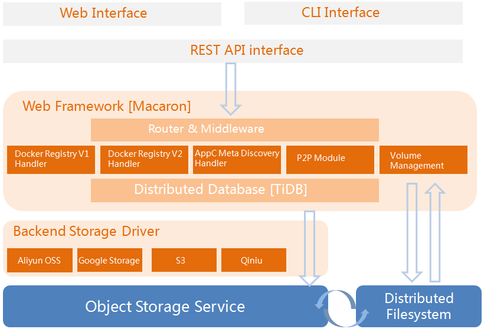

# Dockyard - 容器镜像存储管理中心


## Dockyard是什么
Dockyard是一个能存储和管理docker、rkt等主流容器技术的镜像存储中心，并且也是ContainerOps容器化devops开发平台应用版本控制子系统的关键组件，它的核心功能包括：
- Docker,Rkt主流容器技术的镜像存储、查找以及删除
- P2P镜像分布式存储
- 个人或组织的公共和私人仓库
- 支持对象存储引擎和驱动
- 提供分布式对象存储服务
- 自有的分布式文件系统的卷管理
- 直接从镜像启动容器
- 镜像的加密以及安全验证

## 如何工作
Dockyard的架构详解如下：



## 用途
支持docker和rkt等主流容器的镜像，覆盖了docker v1和v2两种标准，方便镜像的存储使用，无需在意镜像的多种标准

## 现状
Please watch this space for updates on the progress.
Dockyard项目发展迅速并以提供了基础的功能
- 支持Docker V1协议Docker registry V1
- 支持Docker V2协议Docker registry V2
- 支持对象存储驱动
- 支持Rkt 标准镜像
- P2P模式
- 提供oss分布式对象存储服务
- 支持用户及组织权限管理

## 计划
未来的项目计划如下：
- 支持基于分布式的卷管理功能
- 支持分布式镜像存储分发
- 支持Web UI及Cli接口
- 支持镜像加密及验证

## 软件部署
运行Dockyard需要编译完成的Dockyard二进制文件，运行目录下需要有源码目录的conf,cert,views,log四个文件夹以及相关环境配置

### 编译源码获取可执行文件
既可以本地编译:

```bash
# create a 'github.com/containerops' directory in your GOPATH/src
cd github.com/containerops
git clone https://github.com/containerops/dockyard
cd dockyard
make
sudo make install
```

也可以联网下载第三方包编译:

```bash
go get github.com/containerops/dockyard
cd $GOPATH/src/github.com/containerops/dockyard
go build
```
可以通过make命令编译源码，编译所依赖的第三方包来源于源码包的vendor目录；也可以通过go build命令编译源码，那你必须先通过go get 命令将dockyard所依赖的第三方包下载到本地GOPATH/src下，才能编译。考虑到中国网络被墙，有个别第三方包需代理才能下，建议采用第一种方式。

### 环境配置

#### 安装rados库
```bash
apt-get install librados-dev
```

#### 搭建数据库服务器
Dockyard需要数据库的支持，支持mysql和redis（建议用户选择mysql），并在Dockyard的配置项中对接数据库。

#### 配置Dockyard网络域名
建议最好添加，保持多台服务器操作镜像tag的统一，执行如下：

```bash
vim /etc/hosts
```

添加127.0.0.1       containerops.me
* containerops.me: Dockyard服务器的域名

### 交付目录相关说明

* conf: Dockyard运行配置文件的路径，需要新增配置文件runtime.conf
* cert: Dockyard运行必须的证书
* views: Dockyard对外提供可由用户配置的模板，使用于Rkt

#### runtime.conf文件配置说明
运行目录下的conf文件夹下需要添加runtime.conf配置文件，参考如下

```init
runmode = dev

listenmode = http
httpscertfile = cert/containerops/containerops.crt
httpskeyfile = cert/containerops/containerops.key

[log]
filepath = log/containerops-log

[db]
driver = mysql
uri = localhost:3306
user = root
passwd = containerops
name = dockyard
db = 8

[dockyard]
authmode = token
path = data
domains = containerops.me
registry = 0.9
distribution = registry/2.0
standalone = true
backend = rados
cachable = false

[token]
realm = http://containerops.me/uam/auth
service = token-service
issuer = registry-token-issuer
rootcertbundle = cert/containerops/containerops.crt

[auth_server]
issuer = registry-token-issuer
privateKey = cert/containerops/containerops.key
expiration = 5000 
authn = authn_db

[rados]
chunksize = 4196304
poolname = XXX
username = XXX

[authn_ldap]
addr = china.huawei.com:636
tls = yes                
insecuretlsskipverify = yes
domain = china
```

runmode: Dockyard运行模式，支持 dev（开发） or prod（产品）两种模式
* listenmode: 支持的网络协议，支持 http or https 两种
* httpscertfile: https的证书路径
* httpskeyfile: https的证书路径
* [log] filepath: Dockyard运行时默认记录日志路径
* [db] driver: Dockyard存储镜像信息的数据库，目前支持mysql和redis
* [db] uri: Dockyard数据库服务器所在的ip地址，mysql格式IP:3306，redis格式IP:6379
* [db] user: 登录数据库的用户，mysql服务器的配置参数
* [db] passwd: 登录数据库的密码，mysql服务器的配置参数
* [db] name: 数据库的名字，mysql服务器的配置参数
* [db] db: 数据库的索引号， redis服务器的配置参数
* [dockyard] authmode: Dockyard用户鉴权模式，当前支持token
* [dockyard] path: Docker和Rocket镜像文件存储在本地仓库的位置
* [dockyard] domains: Dockyard的域名或IP地址, http模式时默认为80端口，其他端口需添加端口号，如：containerops.me:9911
* [dockyard] registry: Docker V1 协议的版本
* [dockyard] distribution: Docker V2 协议的版本
* [dockyard] standalone: 设定为true or false, Dockyard的运行模式是否要授权检查
* [dockyard] backend：对象存储服务器，目前支持rados等服务
* [dockyard] cachable: 本地缓存，true 表示缓存存在本地 false 表示不缓存在本地
* [token] Dockyard用户权限校验配置
* [token] realm: 链接用户鉴权中心的url，例如：链接Dockyard用户鉴权中心：scheme://domain:port/uam/auth
* [token] service: 用户鉴权服务标识，名称无特殊限制
* [token] issuer：机构名称，名称无特殊限制，与[auth_server]的issuer参数保持一致
* [token] rootcertbundle：证书路径
* [auth_server] 用户鉴权中心配置
* [auth_server] issuer：机构名称，名称无特殊限制，与[token]的issuer参数保持一致
* [auth_server] privateKey：私钥路径
* [auth_server] expiration：token超时时限，单位秒
* [auth_server] authn：用户认证方式，支持authn_db和authn_ldap。
* [authn_ldap] 用户认证方式
* [authn_ldap] addr: ldap认证服务器，normal:389,tls:636
* [authn_ldap] tls: 是否通过tls传输，yes或no
* [authn_ldap] insecuretlsskipverify: 是校验证书合法性，yes或no
* [authn_ldap] domain: 认证用户所属域
* [rados] chunksize: 存储在ceph对象存储服务器的最大块大小，置空的话默认为4M
* [rados] poolname: ceph对象存储服务器的数据池名称
* [rados] username: ceph对象存储服务器的用户

### nginx配置说明
以下为nginx配置文件模板，你可以改变 **client_max_body_size** 上传文件大小的限制，将 `cert/containerops.me`下的证书复制到`/etc/nginx`, 然后在`http`模式下运行 **Dockyard**  监听地址为 `127.0.0.1:9911`.

```nginx
upstream dockyard_upstream {
  server 127.0.0.1:9911;
}

server {
  listen 80;
  server_name containerops.me;
  rewrite  ^/(.*)$  https://containerops.me/$1  permanent;
}

server {
  listen 443;

  server_name containerops.me;

  access_log /var/log/nginx/containerops-me.log;
  error_log /var/log/nginx/containerops-me-errror.log;

  ssl on;
  ssl_certificate /etc/nginx/containerops.me.crt;
  ssl_certificate_key /etc/nginx/containerops.me.key;

  client_max_body_size 1024m;
  chunked_transfer_encoding on;

  proxy_redirect     off;
  proxy_set_header   X-Real-IP $remote_addr;
  proxy_set_header   X-Forwarded-For $proxy_add_x_forwarded_for;
  proxy_set_header   X-Forwarded-Proto $scheme;
  proxy_set_header   Host $http_host;
  proxy_set_header   X-NginX-Proxy true;
  proxy_set_header   Connection "";
  proxy_http_version 1.1;

  location / {
    proxy_pass         http://dockyard_upstream;
  }
}
```

### 启动Dockyard服务

```bash
docker daemon --insecure-registry containerops.me &
```

- 直接运行:

```bash
./dockyard web --address 0.0.0.0 --port 80
```

- 在nginx环境运行:

```bash
./dockyard web --address 127.0.0.1 --port 9911
```

### Dockyard命令说明

- 命令：
* web: 启动Dockyard服务
* help: 显示命令列表

- 命令参数：
* --address web命令参数，表示Dockyard监听的ip地址
* --port    web命令参数，表示Dockyard监听地址的端口号

- 全局参数：
* --help	显示命令列表
* --version 显示Dockyard版本号

### 用户与组织管理

#### 用户操作
- 注册用户
```bash
POST containerops.me/uam/user/signup 
```
Body为json字符串，格式如下
```bash
type User struct {
	Name     string    `json:"name"`
	Email    string    `json:"email"`
	Password string    `json:"password"`
	RealName string    `json:"realname,omitempty"`
	Comment  string    `json:"comment,omitempty"` 
}
```

#### 组织操作
- 创建组织
```bash
POST containerops.me/uam/organization
```
Body为json字符串，格式如下
```bash
type Organization struct {
	Name            string    `json:"name"`
	Email           string    `json:"email,omitempty"`
	Comment         string    `json:"comment,omitempty"`
	URL             string    `json:"url,omitempty"`
	Location        string    `json:"location,omitempty"`
	MemberPrivilege int       `json:"memberprivilege,omitempty"` //WRITE=2,READ=3,NONE=4
}
```
MemberPrivilege 为组织普通成员对组织下仓库的访问权限，WRITE=2：读写；READ=3：读；NONE=4：对公共参考读。

- 删除组织
以删除huawei为例
```bash
DELETE containerops.me/uam/huawei
```

- 添加用户到组织
```bash
POST containerops.me/uam/organization/adduser
```
Body为json字符串，格式如下
```bash
type OrganizationUserMap struct {
	UserName string `json:"username"`
	Role     int    `json:"role"` //role of user in organization, admin=3 or member=4
	OrgName  string `json:"orgname"`
}
```
仅有组织的admin有权限添加用户到组织，admin用户对组织下所有仓库有创建，读写权限。

- 从组织删除用户
以删除huawei下l00257029为例子
```bash
DELETE containerops.me/uam/organization/removeuser/huawei/l00257029
```
仅有组织的admin有权限从组织删除用户

#### 组操作
- 创建组
```bash
POST containerops.me/uam/team
```
Body为json字符串，格式如下
```bash
type Team struct {
	TeamName string `json:"teamname"`
	Comment  string `json:"comment,omitempty"`
	OrgName  string `json:"orgname"`
}
```

- 删除组
以删除huawei下ossc为例
```bash
DELETE containerops.me/uam/team/huawei/ossc
```

- 添加用户到组
```bash
POST containerops.me/uam/team/adduser
```
Body为json字符串，格式如下
```bash
type TeamUserMap struct {
	TeamName string `json:"teamname"`
	OrgName  string `json:"orgname"`
	UserName string `json:"username"`
	Role     int    `json:"role"` //role of  team, admin=5 or member=6
}
```

- 从组删除用户
以删除huawei下ossc下l00257029为例
```bash
DELETE containerops.me/uam/team/removeuser/huawei/ossc/l00257029
```

- 建立组织到仓库权限关联
```bash
POST containerops.me/uam/team/addrepository
```
Body为json字符串，格式如下
```bash
type TeamRepositoryMap struct {
	OrgName  string `json:"orgname"`
	RepoName string `json:"reponame"`
	TeamName string `json:"teamname"`
	Permit   int    `json:"permit"` //team permit for repo ,WRITE=2 or READ=3
}
```
若permit为WRITE，那么组下所有用户对此仓库有读写权限，若为READ,那么组下所有用户对此仓库有读权限。

- 删除组织到仓库权限关联
以删除huawei下组ossc与busybox关联为例
```bash
DELETE containerops.me/uam/team/removerepository/huawei/ossc/busybox
```

#### 仓库操作
- 创建仓库
```bash
POST containerops.me/uam/repository
```
Body为json字符串，格式如下
```bash
type Repository struct {
	Name     string `json:"name"`
	IsPublic bool   `json:"ispublic"` //true:public; false:private
	Comment  string `json:"comment,omitempty"`
	OrgName  string `json:"orgname,omitempty"`
	UserName string `json:"username,omitempty"`
}
```
其中OrgName，UserName二选一，必须一个为空，一个非空

- 删除仓库
以删除root用户下busybox为例
```bash
DELETE containerops.me/uam/root/busybox
```

### 镜像的操作
以test/busybox:latest镜像举例
#### docker login操作
```bash
docker login containerops.me
```

#### docker push/pull操作
```bash
docker push containerops.me/test/busybox
docker pull containerops.me/test/busybox
```

### 调用API操作
__注意：在应用用户鉴权的场景下，如果通过命令行或http方法等方式调用API接口，在调用前需要在http head的“Authorization”字段明确用户的登录信息。__
例如使用curl工具调用API查询所有镜像，其中“Authorization”为用户校验的固定字段，“Basic”为用户登录信息的固定字段，“cm9vdDpyb290”为 “用户名:密码” 的base64密文。
```bash
curl -H "Authorization: Basic cm9vdDpyb290" -X GET http://containerops.me/v2/_catalog
```

#### docker镜像查询操作
Dockyard的查询操作与docker官方API保持一致，通过调用API来获取镜像信息。
- 查询所有镜像
```bash
GET containerops.me/v2/_catalog 
```

- 查询test/busybox的所有tag信息
```bash
GET containerops.me/v2/test/busybox/tags/list 
```

- 查询test/busybox:latest镜像的详细信息
```bash
GET containerops.me/v2/test/busybox/manifests/latest
```

#### docker镜像的删除操作
Dockyard的删除操作与docker官方API保持一致，通过调用API来删除镜像
- 删除manifest镜像信息
```bash
DELETE containerops.me/v2/test/busybox/manifests/sha256:XXX
```

- 删除blob镜像本体
```bash
DELETE containerops.me/v2/test/busybox/blobs/sha256:XXX
```